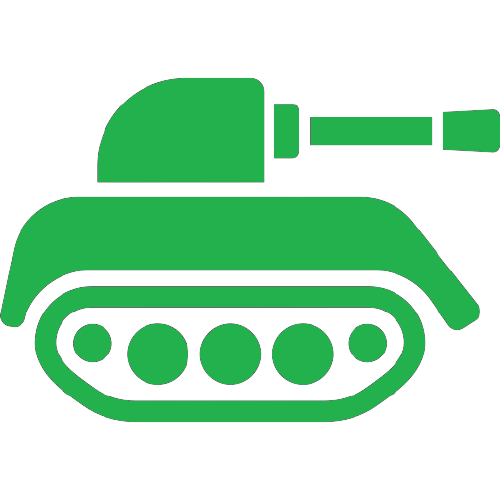
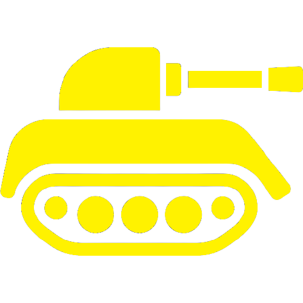
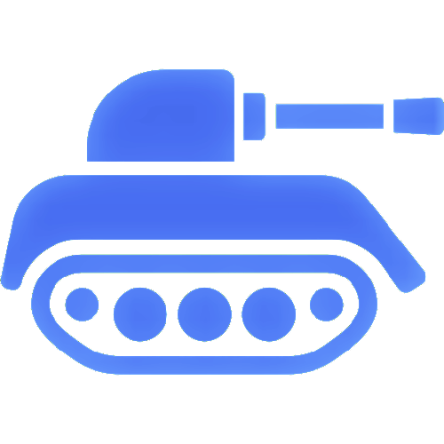
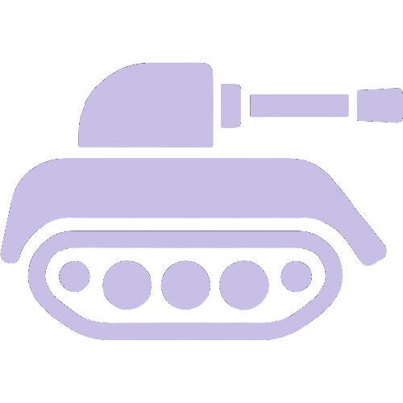
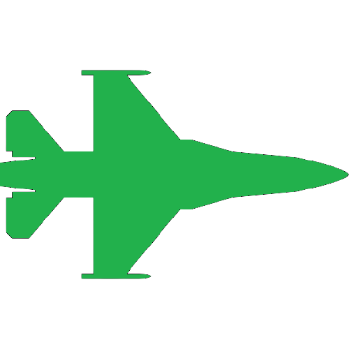
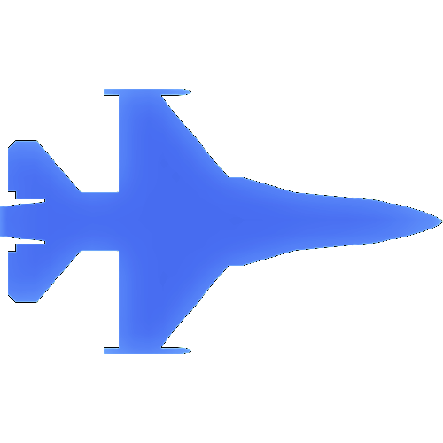
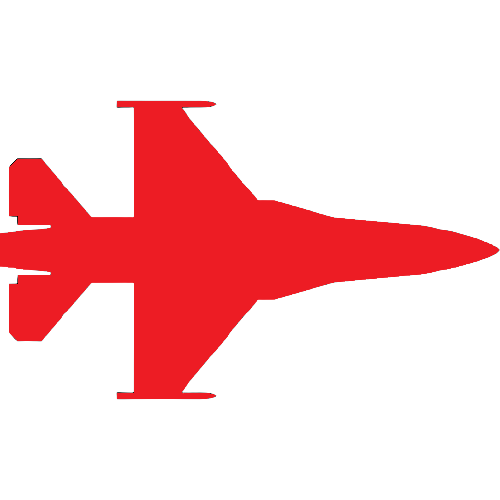

# 3rd Force

https://123yoshidandy.github.io/3rd-force/

## はじめに

本ゲームは、 [マメッコホームページ](http://mamecco.es.land.to/) の「3rd Force」を独自に実装したものである。
ゲームシステムはタワーディフェンスに近いが、兵器の生成等の戦術アルゴリズムをユーザが実装することが特徴的である。
つまり、戦局（現在の優劣勢、相手が生成した兵器種別等）に応じて、適切な兵器配置により勝利を目指す。
 
イメージを掴むために、まずは当ページ上部に記載したURLへアクセスしてほしい。
[こちら](https://github.com/yoshida-kazuki/game-3rd-force#兵器一覧) で定義する兵器が左右から現れ、敵陣に向かう。
兵器生成のためにはMoneyが必要であり、これは時間により自然増加する。
歩兵もしくは爆撃機が敵陣まで到達すると、ダメージを与えることができる。
ダメージを与えて相手のLifeがなくなると勝利となる。
 

## 遊び方

詳細は既存コードを参考にしてもらうものとし、手順のみ記す。

1. GitHubリポジトリをfork→cloneする。 
   https://github.com/yoshida-kazuki/game-3rd-force
2. 戦術アルゴリズムを実装する。 
   https://github.com/yoshida-kazuki/game-3rd-force/tree/main/js/tactics
3. 戦術アルゴリズムをアルゴリズム一覧（以下のソースコードの変数TACTICS）に追加する。 
   https://github.com/yoshida-kazuki/game-3rd-force/blob/main/js/main.js
4. 以下などを活用し、動作検証する。 
   https://marketplace.visualstudio.com/items?itemName=ritwickdey.LiveServer
5. いい感じにできたら、yoshida-kazukiのリポジトリにプルリクエストを発行する。

## 兵器一覧

| ID       | 兵器名                                                | 特徴（詳細は[こちら](https://github.com/yoshida-kazuki/game-3rd-force/blob/main/js/main.js)のARM_TYPESを参照） |
| --       | --                                                    | -- |
| infantry |  歩兵       | 戦闘力は低いが陣地にも攻撃可能 |
| tank     |  戦車           | 耐久力・攻撃力に優れる戦闘の要 |
| rocket   |  ロケット砲   | 地上機への遠距離攻撃が可能 |
| missile  |  対空ミサイル | 航空機への遠距離攻撃が可能 |
| cannon   |  機関砲       | 地上・航空両方への攻撃が可能 |
| attacker |  攻撃機     | コストは高いが、対地性能に優れる航空機 |
| fighter  |  戦闘機      | コストは高いが、対空性能に優れる航空機 |
| bomber   |  爆撃機       | コストは高いが、高速で陣地攻撃可能な航空機 |

## Tips

* 兵器は重なることができない。重なっている生成命令はスキップされ、移動時に重なった場合にはズレるよう制御される。
* 兵器が退却すると、生成コストが還元される。退却条件は戦術アルゴリズムにて定義する。
* ロケット砲などの射程に優れる兵器は、敵兵器から一定距離を保つよう制御することで一方的に攻撃可能である。移動先は戦術アルゴリズムにて定義する。
* 兵器カスタマイズは、標準値×(0.5～1.5）の範囲で設定可能である。

## TODO

* 機能（マメッコ実装済）
    * 兵器カスタマイズの本導入
* 機能（オリジナル）
    * ランキング機能の導入（戦術アルゴリズムを自動高速戦闘させ、ランキングを動的生成する）
    * 手動モードの導入
* その他
    * 表示の改善
